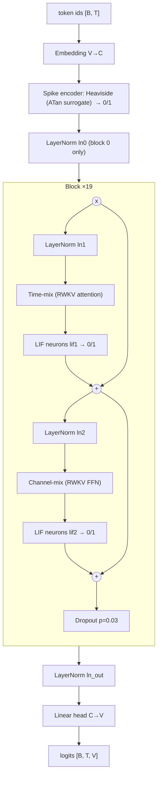

# SpikeGPT, Layer by Layer

This guide explains every layer and every neuron in this repository's SpikeGPT. It is written for
someone who has trained CNNs (or MLPs or Transformers) in PyTorch but has not worked with
**spiking neural networks (SNNs)**.

The running example is the **SpikeGPT-1B** configuration that `train.py` now trains. It has the
same parameter count as Llama 3.2 1B. Wherever a tensor shape appears, it uses these values:

| Symbol | Meaning | SpikeGPT-1B value |
|---|---|---|
| `B` | batch size (per GPU) | 8 |
| `T` | context length = number of tokens = **number of SNN time steps** | 1024 |
| `C` | embedding width (`n_embd`) | 2048 |
| `L` | number of blocks (`n_layer`) | 19 |
| `V` | vocabulary size (20B / GPT-NeoX tokenizer) | 50277 |

Code references point to `src/model.py` (the parallel model used for **training**) and
`src/model_run.py` (the recurrent model used for **text generation**).

---

## 1. SNNs in five minutes, for someone who knows CNNs

### 1.1 What a neuron does in a CNN

In a CNN, a "neuron" is just a number: `y = relu(w·x + b)`. It has no memory. If you feed the
same image twice, you get the same output twice. Time does not exist.

### 1.2 What a neuron does in an SNN

A spiking neuron is a tiny **stateful** machine. It has a hidden variable called the **membrane
potential** `v` that persists from one time step to the next. On every step it:

1. **Charges**: adds the incoming signal to `v`, while `v` also leaks back toward zero.
2. **Fires**: if `v` reaches a threshold, it outputs a **spike**, which is exactly `1`. Otherwise it
   outputs exactly `0`.
3. **Resets**: if it fired, `v` drops back to zero.

The output is therefore **binary** (0 or 1), and it depends on the history of inputs, not only the
current input.

### 1.3 Why anyone wants this

On neuromorphic hardware (and in principle on any hardware), a binary activation means the next
layer's matrix multiply turns into **additions only**: multiplying a weight by 1 is the weight,
and multiplying by 0 is nothing. If most neurons are silent (0), most of that work is skipped.
This is called being *event-driven*, and it is the energy argument behind SpikeGPT.

### 1.4 Where "time" comes from in SpikeGPT

This is the single most important idea in this codebase:

> **SpikeGPT uses the token position as the SNN time axis.**

An image SNN usually repeats the same image for, say, 4 time steps. SpikeGPT does not repeat
anything. Token 0 is time step 0, token 1 is time step 1, and so on up to token `T-1`. A neuron's
membrane potential carries information from earlier tokens to later tokens, just like an RNN
hidden state. That is why you will see `.permute(1, 0, 2)` around every spiking layer: the
spiking library expects the time axis first (`[T, B, C]`), while the rest of the model uses
`[B, T, C]`.

### 1.5 Concept map

| You know this from CNNs / Transformers | The SNN / SpikeGPT counterpart |
|---|---|
| Activation function (ReLU, GELU) | Spiking neuron (LIF): stateful, output is 0/1 |
| Activation value (a real number) | Spike (exactly 0 or 1) |
| No memory between inputs | Membrane potential `v` carries memory across tokens |
| Gradient of ReLU | **Surrogate gradient**: a smooth fake gradient for the step function |
| Self-attention, `O(T²)` | RWKV "WKV" linear attention, `O(T)`, can run as an RNN |
| Re-running the network on each image | Must **reset** the membrane potential between batches |

---

## 2. The neuron: Leaky Integrate-and-Fire (LIF)

Every spiking neuron in SpikeGPT is a **LIF neuron** from the vendored SpikingJelly library
(`src/spikingjelly/clock_driven/neuron.py`). In `src/model.py` it is created like this:

```python
self.lif1 = neuron.MultiStepLIFNode(tau=2., surrogate_function=surrogate.ATan(alpha=2.0),
                                    backend='cupy', v_threshold=1.)
```

All other settings stay at their defaults: `v_reset=0.0` (hard reset), `decay_input=True`,
`detach_reset=False`. None of these values is learned: **LIF neurons have no trainable
parameters**.

### 2.1 The three equations

For one neuron, with input `x[t]` at time step (token) `t`:

```
charge:  h[t] = v[t-1] + (x[t] - v[t-1]) / tau        # with tau = 2:  h[t] = (v[t-1] + x[t]) / 2
fire:    s[t] = 1 if h[t] >= v_threshold else 0       # v_threshold = 1
reset:   v[t] = 0 if s[t] == 1 else h[t]              # hard reset to v_reset = 0
```

and `v[-1] = 0` at the start of every sequence.

With `tau = 2` the charge step is simply "average the old potential with the new input". The
neuron forgets half of its past on every token. This is the **leak**.

### 2.2 A worked example

These numbers come from running the repo's `MultiStepLIFNode` on a single neuron:

| token `t` | 0 | 1 | 2 | 3 | 4 | 5 | 6 |
|---|---|---|---|---|---|---|---|
| input `x[t]` | 0.8 | 1.5 | 0.3 | 2.4 | 1.2 | 1.2 | 1.2 |
| `h[t] = (v[t-1]+x[t])/2` | 0.40 | 0.95 | 0.625 | 1.5125 | 0.60 | 0.90 | 1.05 |
| spike `s[t]` | 0 | 0 | 0 | **1** | 0 | 0 | **1** |
| `v[t]` after reset | 0.40 | 0.95 | 0.625 | 0 | 0.60 | 0.90 | 0 |

Things to notice:

* One large input (2.4 at `t=3`) fires the neuron immediately.
* A steady moderate input (1.2) needs several tokens to build up before it fires (`t=6`).
* A constant input of exactly 1.0 **never** fires: `h` goes 0.5, 0.75, 0.875, … and approaches 1
  without reaching it. The neuron only fires for input that is consistently stronger than the
  threshold, or for a sudden burst.

So the neuron is a little temporal filter: it turns a real-valued signal over tokens into a sparse
binary code over tokens.

### 2.3 How do you backpropagate through a step function? (surrogate gradients)

The fire step `s = (h >= 1)` is a Heaviside step function. Its true derivative is zero everywhere
(and undefined at the threshold), so ordinary backprop would pass **no gradient at all**.

The fix is a **surrogate gradient**: in the forward pass we use the real step function, but in the
backward pass we pretend it was a smooth function. SpikeGPT uses the **ATan** surrogate
(`surrogate.ATan(alpha=2.0)`), whose pretend-function is

```
g(x)  = arctan(pi/2 * alpha * x) / pi + 1/2          (a smooth S-curve from 0 to 1)
g'(x) = alpha / (2 * (1 + (pi/2 * alpha * x)^2))     (used as the gradient)
```

where `x = h - v_threshold`, the distance of the potential from the threshold. With `alpha = 2`
this simplifies to `g'(x) = 1 / (1 + (pi * x)^2)`:

| distance from threshold `h - 1` | 0 | ±0.25 | ±0.5 | ±1.0 |
|---|---|---|---|---|
| surrogate gradient | 1.000 | 0.618 | 0.288 | 0.092 |

Neurons sitting close to their threshold get a strong gradient ("a small nudge would change whether
I fire"); neurons far from it get a weak one. If you have used straight-through estimators for
quantized networks, this is the same idea.

Because the reset depends on the spike, and the next step's potential depends on the reset,
the gradient also flows **backwards through time** across tokens (backpropagation through time,
BPTT). With `backend='cupy'` this whole forward and BPTT loop over the 1024 tokens is one fused
CUDA kernel (`neuron_kernel.py`, `MultiStepLIFNodePTT`).

### 2.4 Resetting state between batches

Because neurons remember `v`, the end of one batch would leak into the start of the next. The
trainer calls

```python
loss = model(x, y)
functional.reset_net(model)   # src/trainer.py
```

after every forward pass. `reset_net` walks every module and sets each neuron's `v` back to 0.
Forgetting this is the classic SNN bug: you would get silently wrong results, not an error.

### 2.5 How many neurons are there?

Each block has two LIF layers (`lif1`, `lif2`), each with one neuron per channel. In
SpikeGPT-1B that is `19 blocks × 2 × 2048 = 77,824` LIF neurons. Each one runs independently for
every sequence in the batch and keeps its own membrane potential.

There is also one **stateless** spiking layer at the input (section 3.2). It uses the same ATan
step function but has no membrane and no leak.

---

## 3. The full architecture

### 3.1 Overview



If you know a Transformer decoder, the skeleton is identical: embedding, a stack of pre-norm
residual blocks each holding a "token mixing" sublayer and a "channel mixing" sublayer, a final
norm, and a linear head. The three differences are:

1. The token mixer is **RWKV time-mix**, a linear-time attention, not softmax self-attention.
2. Each sublayer's output passes through a **LIF neuron layer** before it is added to the
   residual stream. What each sublayer writes into the residual stream is therefore binary.
3. There are **no positional embeddings**. Order is known through the token shift (3.4) and the
   time decay inside WKV (3.5).

A precise note on "binary": the spikes are the embedding encoding and everything the sublayers
add to the residual stream. The residual stream itself becomes real-valued after the first
LayerNorm `ln0` (a LayerNorm of a 0/1 vector, with learned scale and shift, is not 0/1), and the
inputs to the Linear layers inside each sublayer are LayerNorm outputs, so they are real-valued too.

### 3.2 Input: embedding and spike encoding (`GPT.forward`)

```python
x = self.atan(self.emb(idx))     # self.atan = surrogate.ATan()  (alpha = 2)
```

| step | operation | shape |
|---|---|---|
| token ids | input | `[B, T]` = `[8, 1024]` |
| `emb` | `nn.Embedding(50277, 2048)` lookup | `[8, 1024, 2048]` |
| `atan` | `s = 1 if e >= 0 else 0`, ATan gradient | `[8, 1024, 2048]`, values in {0, 1} |

Note that `ATan` here is used as a **stateless** spiking function: each embedding entry is simply
thresholded at 0. So every token is encoded as a 2048-bit binary pattern. The embedding *values*
still matter for training, because the surrogate gradient tells the optimizer how to push each
entry across 0.

### 3.3 Block structure (`Block.forward`)

```python
if self.layer_id == 0:
    x = self.ln0(x)
x = x + self.lif1(self.att(self.ln1(x)).permute(1, 0, 2)).permute(1, 0, 2)
x = x + self.lif2(self.ffn(self.ln2(x)).permute(1, 0, 2)).permute(1, 0, 2)
x = self.dropout(x)
```

Read it as two residual updates, each of the form
`x ← x + Spike( Sublayer( LayerNorm(x) ) )`:

* `ln1`, `ln2`: ordinary `nn.LayerNorm(2048)` over channels (learned scale and bias).
* `att`: time-mix (3.4–3.5). Output `[B, T, C]`, real-valued.
* `ffn`: channel-mix (3.6). Output `[B, T, C]`, real-valued.
* `lif1`, `lif2`: the sublayer output is treated as **input current** to 2048 LIF neurons, run
  over the 1024 token time steps. Output `[B, T, C]` in {0, 1}.
* `dropout(0.03)` on the residual stream at the end of every block.

The `.permute(1, 0, 2)` turns `[B, T, C]` into `[T, B, C]` so the LIF layer iterates over tokens.

The config option `model_type='RWKV-ffnPre'` replaces block 0's time-mix with an extra
channel-mix. `train.py` uses the default `'RWKV'`.

### 3.4 Time-mix, part 1: token shift and the k, v, r projections (`RWKV_TimeMix.jit_func`)

Before projecting, each token's features are blended with the **previous** token's features:

```python
xx = self.time_shift(x)          # ZeroPad2d((0,0,1,-1)): shift the sequence down by one token
xk = x * self.time_mix_k + xx * (1 - self.time_mix_k)
xv = x * self.time_mix_v + xx * (1 - self.time_mix_v)
xr = x * self.time_mix_r + xx * (1 - self.time_mix_r)
k = self.key(xk);  v = self.value(xv);  r = self.receptance(xr)
sr = torch.sigmoid(r)
```

If you know 1D convolutions: the token shift is a **depthwise causal convolution with kernel
size 2**, where the per-channel weights are `time_mix` and `1 - time_mix`. Token 0 sees a zero
vector as its "previous token". Each channel learns how much of "now" and how much of "one token
ago" it wants.

| parameter | shape | role |
|---|---|---|
| `time_mix_k`, `time_mix_v`, `time_mix_r` | `[1, 1, 2048]` each | per-channel blend of current vs. previous token |
| `key` | Linear 2048→2048, no bias | `k`: how strongly this token should be remembered |
| `value` | Linear 2048→2048, no bias | `v`: what content to remember |
| `receptance` | Linear 2048→2048, no bias | `r`: gate; `sigmoid(r)` decides how much of the read-out to let through |

`k` and `v` play the roles of key and value from attention. There is no query. Instead, the
receptance gate `sigmoid(r)` decides, per channel, how much of the retrieved memory to let
through.

### 3.5 Time-mix, part 2: the WKV operator (`WKV`, `cuda/wkv_cuda.cu`)

```python
rwkv = sr * RUN_CUDA(B, T, C, self.time_decay, self.time_first, k, v)
rwkv = self.output(rwkv)        # Linear 2048→2048, no bias
```

For every channel `c` independently, WKV computes a weighted average of all past values, with
weights that **decay exponentially with distance**:

```
              sum_{i<t} exp(-(t-1-i)·w + k_i) · v_i   +   exp(u + k_t) · v_t
wkv_t  =  -------------------------------------------------------------------
              sum_{i<t} exp(-(t-1-i)·w + k_i)         +   exp(u + k_t)
```

with `w = exp(time_decay)` (always positive, so it really is a decay) and `u = time_first`.

* Compare to softmax attention: weights are `exp(k_i)` normalized over the past, exactly like
  softmax, **but** there is no query-key dot product. Instead, each past token's weight shrinks by
  a factor `exp(-w)` per token of distance. Different channels learn different `w`, so some
  channels remember for 2 tokens and others for hundreds.
* `u` ("time_first") is a special bonus for the current token, because otherwise it would get the
  same treatment as a token 0 steps in the past.
* Because the weights decay geometrically, the two sums can be updated **recursively**:
  `a_t = exp(-w)·a_{t-1} + exp(k_t)·v_t` (same for the denominator `b_t`). This is why the whole
  model can run as an RNN at generation time with `O(1)` cost per token, and why training costs
  `O(T)` instead of attention's `O(T²)`.
* The CUDA kernel keeps a running maximum exponent (`o`, or `pp` in `model_run.py`) and subtracts
  it before every `exp`, the same trick as a numerically stable softmax.

| parameter | shape | init | role |
|---|---|---|---|
| `time_decay` | `[2048]` | from -5 to 3, spread across channels | per-channel forgetting speed |
| `time_first` | `[2048]` | `log(0.3)` ± 0.5 zigzag | per-channel bonus for the current token |
| `output` | Linear 2048→2048 | | projects the gated read-out back to the residual width |

The CUDA kernel runs in fp32 and has two hard constraints, checked by `assert` in `WKV.forward`:
`T <= T_MAX` (1024, compiled into the kernel) and `B*C` divisible by `min(C, 1024)`.

The output of `self.output(...)` is real-valued. It becomes the input current for `lif1`.

### 3.6 Channel-mix: the feed-forward network (`RWKV_ChannelMix`)

```python
xx = self.time_shift(x)
xk = x * self.time_mix_k + xx * (1 - self.time_mix_k)
xr = x * self.time_mix_r + xx * (1 - self.time_mix_r)
k  = torch.square(torch.relu(self.key(xk)))       # 2048 → 8192, squared ReLU
kv = self.value(k)                                  # 8192 → 2048
rkv = torch.sigmoid(self.receptance(xr)) * kv     # 2048 → 2048 gate
```

This is the Transformer MLP (expand 4×, nonlinearity, project back) with two RWKV twists: the same
token shift as time-mix, and a sigmoid **receptance gate** on the output (similar in spirit to the
gate in Llama's SwiGLU MLP). The nonlinearity is `relu(x)²`.

| parameter | shape |
|---|---|
| `time_mix_k`, `time_mix_r` | `[1, 1, 2048]` each |
| `key` | Linear 2048→8192, no bias |
| `value` | Linear 8192→2048, no bias |
| `receptance` | Linear 2048→2048, no bias |

The output `rkv` is real-valued and becomes the input current for `lif2`.

### 3.7 Output head and loss (`GPT.forward`, `L2Wrap`)

```python
x = self.ln_out(x)                 # LayerNorm(2048)
x = self.head(x)                   # Linear 2048 → 50277, no bias, NOT tied to emb
loss = F.cross_entropy(x.view(-1, V), targets.view(-1))
return L2Wrap.apply(loss, x)
```

Standard next-token cross-entropy. `L2Wrap` does not change the loss value. In the backward pass
it adds a small extra gradient (`1e-4 / (B·T)` times the largest logit) to the largest logit of
each position, which gently pushes logits toward 0 and keeps them from growing without bound.

---

## 4. Parameter count: SpikeGPT-1B vs. Llama 3.2 1B

Per block, with `C = 2048`:

| module | formula | parameters |
|---|---|---|
| time-mix `key`, `value`, `receptance`, `output` | `4·C²` | 16,777,216 |
| time-mix `time_decay`, `time_first`, `time_mix_k/v/r` | `5·C` | 10,240 |
| channel-mix `key` + `value` | `2·4C²` | 33,554,432 |
| channel-mix `receptance` | `C²` | 4,194,304 |
| channel-mix `time_mix_k/r` | `2·C` | 4,096 |
| `ln1`, `ln2` | `4·C` | 8,192 |
| LIF neurons | none | 0 |
| **block total** | `13·C² + 11·C` | **54,548,480** |

Whole model:

| part | formula | parameters |
|---|---|---|
| 19 blocks | `L·(13·C² + 11·C)` | 1,036,421,120 |
| `emb` | `V·C` | 102,967,296 |
| `head` (separate from `emb`) | `V·C` | 102,967,296 |
| `ln0`, `ln_out` | `4·C` | 8,192 |
| **total** | `L·(13C²+11C) + 4C + 2VC` | **1,242,363,904** |

The formula was checked against `sum(p.numel())` of the built `GPT` module, and it also
reproduces the repo's published SpikeGPT-216M (`L=18, C=768`: 215,399,424 parameters).

How the dimensions were chosen: Llama 3.2 1B has 1,235,814,400 parameters (16 layers, width 2048,
MLP width 8192, vocab 128,256, tied embeddings). SpikeGPT-1B keeps Llama's width of 2048 and
SpikeGPT's own vocabulary, MLP ratio, and layer design, then picks the number of layers that gets
closest to Llama's total: 18 layers would be 1.188B (−3.9%), and **19 layers is 1.242B (+0.53%)**.

|  | SpikeGPT-216M (repo) | **SpikeGPT-1B** | Llama 3.2 1B |
|---|---|---|---|
| layers | 18 | **19** | 16 |
| width | 768 | **2048** | 2048 |
| FFN width | 3072 | **8192** | 8192 |
| vocab | 50277 | **50277** | 128256 |
| context | 1024 | **1024** | 131072 |
| token mixing | WKV + LIF | **WKV + LIF** | GQA softmax attention |
| parameters | 215.4M | **1,242.4M** | 1,235.8M |

---

## 5. Two views of the same network: training (parallel) vs. generation (RNN)

The repo contains the same network written twice.

### 5.1 `src/model.py`: the parallel model (training)

Processes all `T` tokens of a sequence at once. WKV runs as a CUDA kernel over the whole sequence,
and LIF runs as a CUDA kernel over all 1024 time steps. This is fast on a GPU and is what
`train.py` uses.

### 5.2 `src/model_run.py`: the recurrent model (generation)

Processes **one token at a time** and carries a fixed-size state from token to token. Per block
it keeps:

| state | size | meaning |
|---|---|---|
| `state[5i+0]` | `C` | channel-mix's previous-token input (for the token shift) |
| `state[5i+1]` | `C` | time-mix's previous-token input (for the token shift) |
| `state[5i+2]`, `state[5i+3]` | `C` each | WKV numerator `a` and denominator `b` |
| `state[5i+4]` | `C` | WKV running max exponent `p` (numerical stability) |
| `mem1[i]`, `mem2[i]` | `C` each | membrane potentials `v` of the `lif1` / `lif2` neurons |

For SpikeGPT-1B that is `19 × 7 × 2048` floats, about **1 MB of state, no matter how long the
text gets**. A Transformer's KV cache grows with every token instead.

### 5.3 The two must agree

Because both files implement the same math, `model_run.py` must produce the same logits as
`model.py` for the same weights and tokens. Two places where they disagreed have been fixed:

1. **Layer rescaling.** `model_run.py` used to divide the residual stream by 2 every 6 layers and
   divide `att.output` / `ffn.value` weights to compensate (`RWKV_RESCALE_LAYER`, an fp16
   overflow guard inherited from RWKV). In plain RWKV that compensation is exact. In SpikeGPT it
   is not, because halving the input to a LIF neuron does not halve its spikes: the threshold is
   fixed at 1, and spikes are 0 or 1. Measured on CPU with identical weights: logits differed
   by up to 6.5 for an 8-layer model. Every model with more than 6 layers, including SpikeGPT-1B,
   was affected. The rescaling is removed.
2. **Embedding spike encoding.** `model_run.py` applied the Heaviside spike encoder to the
   embedding only when `vocab_size == 77` (the character-level model). `model.py` always applies
   it. For the 50277-token vocabulary the logits differed by up to 17. The encoder is now always
   applied.

After both fixes, the maximum logit difference between the two models is about `1e-5` (float
rounding) for 4-, 8- and 20-layer models with both vocabularies.

---

## 6. How SpikeGPT-1B is trained (`train.py`, `src/trainer.py`)

### 6.1 Data

* Corpus: a **binidx** file (`.bin` + `.idx`) tokenized with `20B_tokenizer.json`, for example the
  pre-tokenized Pile linked in the readme. Set `datafile_train` to the path **without** the
  extension.
* Sampling (`src/utils.py`, `Dataset.__getitem__`): every sample is a **random** window of
  `ctx_len + 1 = 1025` tokens. Input is tokens `0..1023`, target is tokens `1..1024`. There is
  no notion of passing over the dataset in order.
* A "mini-epoch" is `epoch_length_fixed = 10,000` such windows, about 10.24M tokens.
  `n_epoch = 1000` mini-epochs is about **10.24B tokens** in total.

### 6.2 One training step

```
x, y  ← batch of random windows                    [B, 1024] each
loss  ← model(x, y)                                 forward over all 1024 tokens (= 1024 SNN steps)
reset_net(model)                                    clear every LIF membrane potential
backward                                            surrogate gradients through spikes, BPTT through tokens
clip_grad_norm_(1.0)
Adam step                                           betas (0.9, 0.99), eps 4e-9, no weight decay
update learning rate
```

### 6.3 Learning-rate schedule

* Linear warmup from `lr_final` up to `lr_init = 3e-4` over the first 2% of tokens
  (`warmup_tokens = 20 mini-epochs`).
* Cosine decay from `lr_init` to `lr_final = 1e-5` over the remaining tokens.

The schedule is driven by the number of tokens seen **by all GPUs together**. (Accelerate gives
each of N GPUs 1/N of every mini-epoch. The trainer used to count only its own GPU's tokens, so on
8 GPUs the cosine decay would have stopped one eighth of the way through. It now multiplies by
`accelerator.num_processes`.)

### 6.4 Hardware budget

Everything runs in fp32: the WKV kernel only supports fp32, and the LIF kernel supports fp32 and
fp16 but not bf16.

* Weights + gradients + Adam moments: `1.24B × 16 bytes ≈ 20 GB` per GPU.
* Activations: an estimated ~5 GB per 1024-token sequence, so `batch_size = 8` adds ~40 GB.
  That fits an 80 GB GPU. Lower `batch_size` on smaller cards.

Launch on all local GPUs with:

```bash
accelerate launch train.py
```

Checkpoints are written as `SpikeGPT-1B-<epoch>.pth` every 10 mini-epochs and after the last
one. To generate text with a checkpoint, set `MODEL_NAME` in `run.py` to its name without `.pth`
(the defaults already use `n_layer = 19`, `n_embd = 2048`) and run `python run.py`.

### 6.5 Initialization

`GPT.__init__` runs the RWKV-specific initialization (`RWKV_Init`: orthogonal matrices, and
zero-init for `att.key`, `att.receptance`, `att.output`, `ffn.value`, `ffn.receptance`) only when
the environment variable `RWKV_LOAD_MODEL` is set to `False`. `train.py` does not set it, so by
default all layers use PyTorch's standard initialization, as in the original repo. The
hand-designed per-channel initializations of `time_decay`, `time_first` and `time_mix_*` always
apply, because they are written directly in the module constructors.

---

## 7. Glossary

| term | meaning |
|---|---|
| **spike** | an output that is exactly 0 or 1 |
| **membrane potential `v`** | a neuron's internal state, carried from one token to the next |
| **LIF** | Leaky Integrate-and-Fire neuron: integrate input, leak toward 0, fire at threshold, reset |
| **`tau`** | membrane time constant. `tau = 2` means half of the old potential is kept each step |
| **threshold** | potential at which the neuron fires (1.0 here) |
| **hard reset** | after a spike, `v` is set to `v_reset = 0` (instead of subtracting the threshold) |
| **surrogate gradient** | the smooth fake derivative used in backprop instead of the step function's zero derivative |
| **BPTT** | backpropagation through time: gradients flow backwards across time steps (here, tokens) |
| **multi-step neuron** | a neuron module that takes a whole `[T, ...]` sequence at once (`MultiStepLIFNode`) |
| **`reset_net`** | sets every neuron's membrane potential back to 0 between sequences |
| **RWKV** | "Receptance Weighted Key Value": the attention-free architecture SpikeGPT is built on |
| **WKV** | RWKV's linear-time weighted average over the past with per-channel exponential decay |
| **token shift** | blending each token's features with the previous token's: a kernel-size-2 causal depthwise conv |
| **receptance** | a sigmoid gate deciding how much of a sublayer's result passes through |
| **binidx** | memory-mapped pre-tokenized corpus format from GPT-NeoX (`.bin` data + `.idx` index) |
